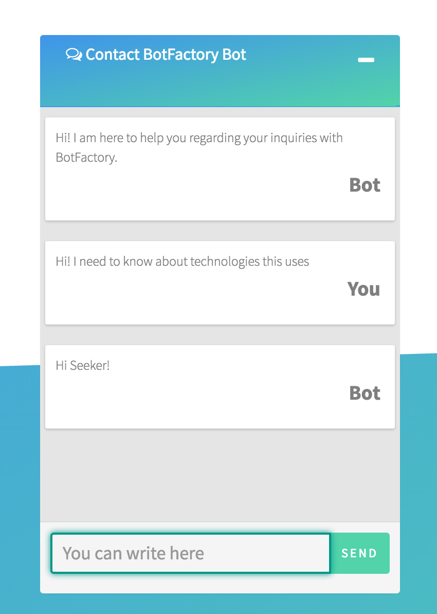

# Chat-Panel
Minimalist chat panel using AngularJS and Bootstrap



##Usage
Use Bower to resolve dependencies. It is a command line utility. Install it with npm.
```bash
bower install
```

Insert following to the index.html

```
    <body ng-controller="Shell as vm">
        <div class="float-box">
            <div class="chat-container">
                <botfac-simple-chat
                        messages="vm.messages"
                        username="vm.username"
                        input-placeholder-text="Write here"
                        submit-button-text="Send"
                        title="Chat Panel"
                        theme="material"
                        submit-function="vm.sendMessage"
                        visible="true">
                </botfac-simple-chat>
            </div>
        </div>
    </body>
```

Change app.js for connecting to the end point
```
var url = "http://someurl/answer";
```
Response should be an application/json with {"reply" : "Reply text"}

For style changes tweek with style.css and for functionality app.js
